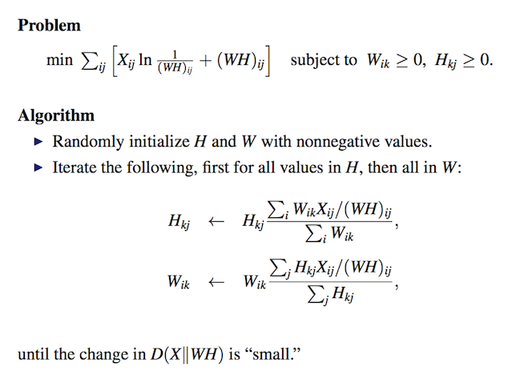
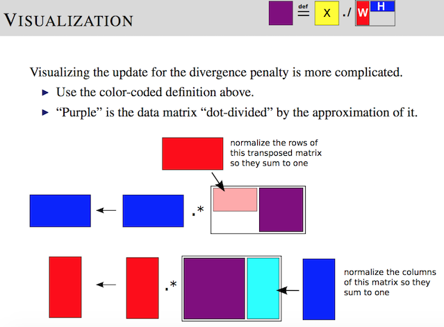
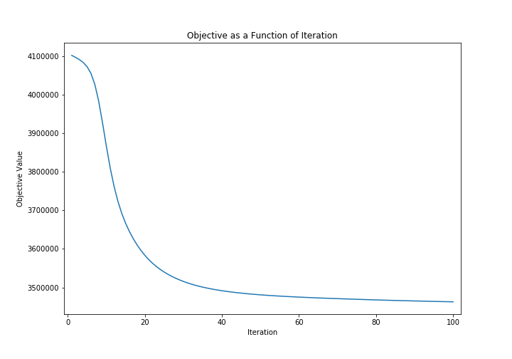
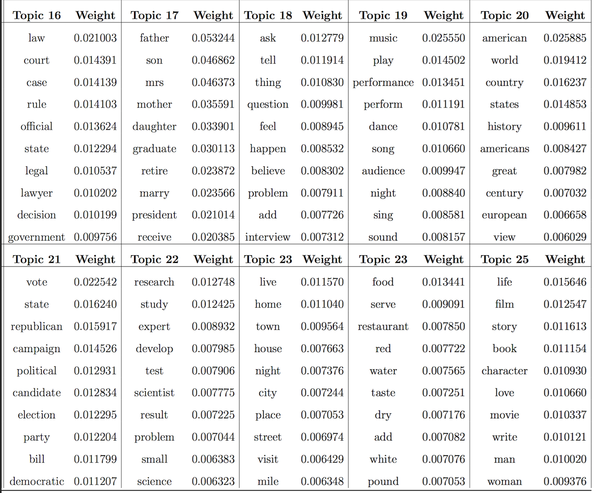

# NYTimes_Topic_Modeling
Implement a Nonnegative Matrix Factorization approach to learn the topics of 8447 documents from the NY Times

In this problem you will factorize an N X M matrix X into a rank-K approximation WH , where W is N X K, H is K X M and all values in the matrices are nonnegative. Each value in W and H can be initialized randomly to a positive number, e.g., from a Uniform(1,2) distribution.

## Data

The data to be used for this problem consists of 8447 documents from The New York Times. The vocabulary size is 3012 words. You will need to use this data to construct the matrix X, where X_ij is the number of times word i appears in document j. Therefore, X is 3012 X 8447 and most values in X will equal zero.

Each row in nyt_data.txt corresponds to a single document. It gives the index of words appearing in that document and the number of times they appear. It uses the format “idx:cnt” with commas separating each unique word in the document. Any index that doesn’t appear in a row has a count of zero for that word. The vocabulary word corresponding to each index is given in the corresponding row of nyt vocab.dat.

## Technology Used
- Python 3

## Algorithm
We will implement the NMF algorithm using the divergence penalty. We will also set the rank to 25 which corresponds to learning 25 topics.

## Results

### Some Topic Examples

